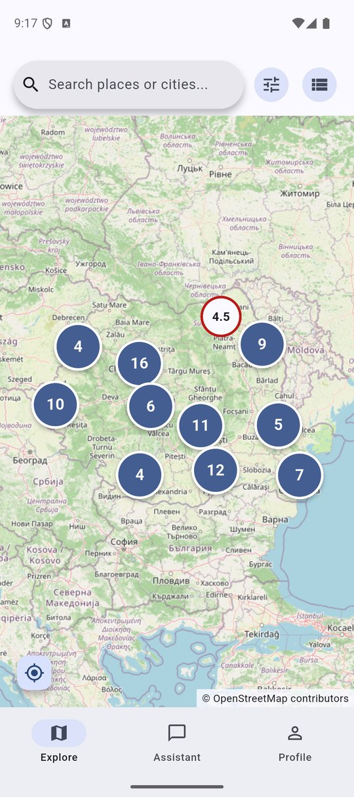
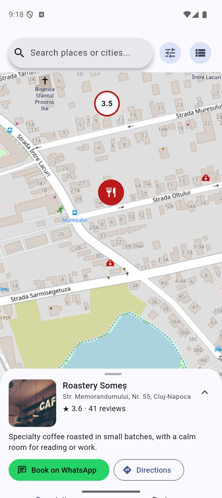
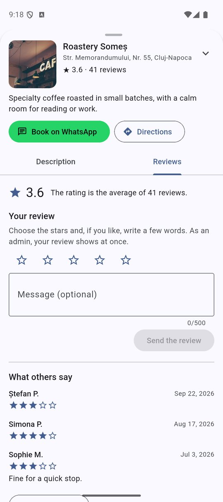
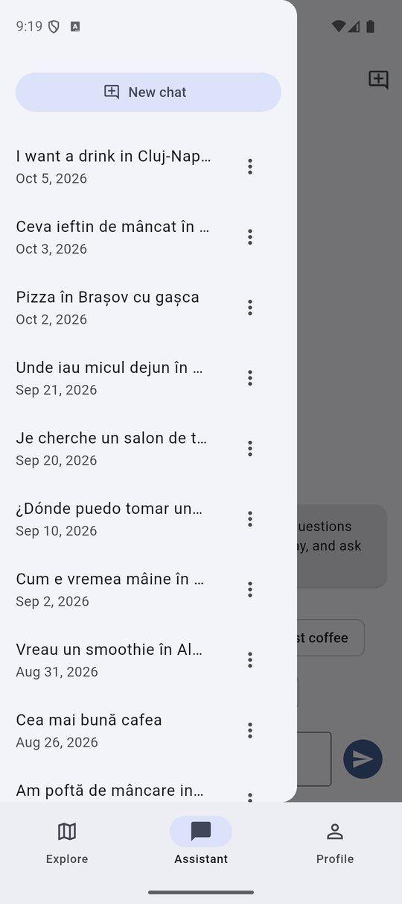
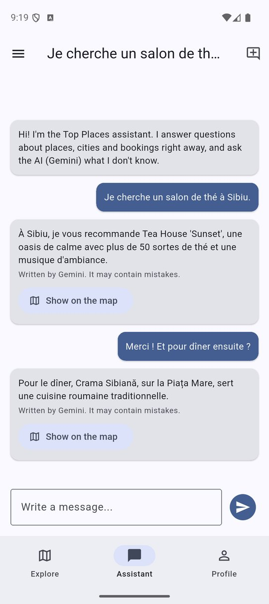
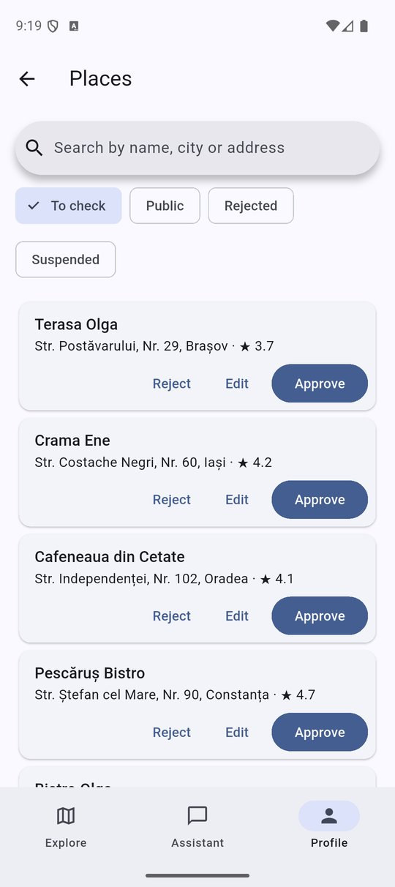
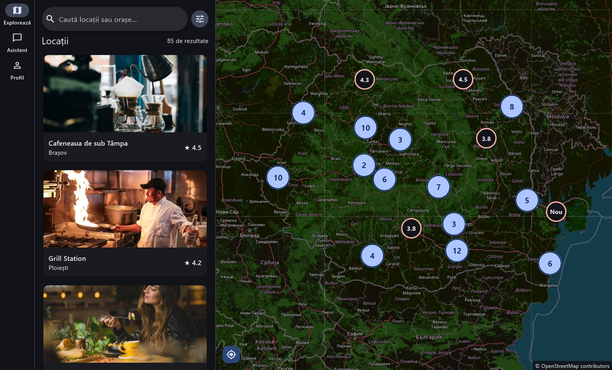
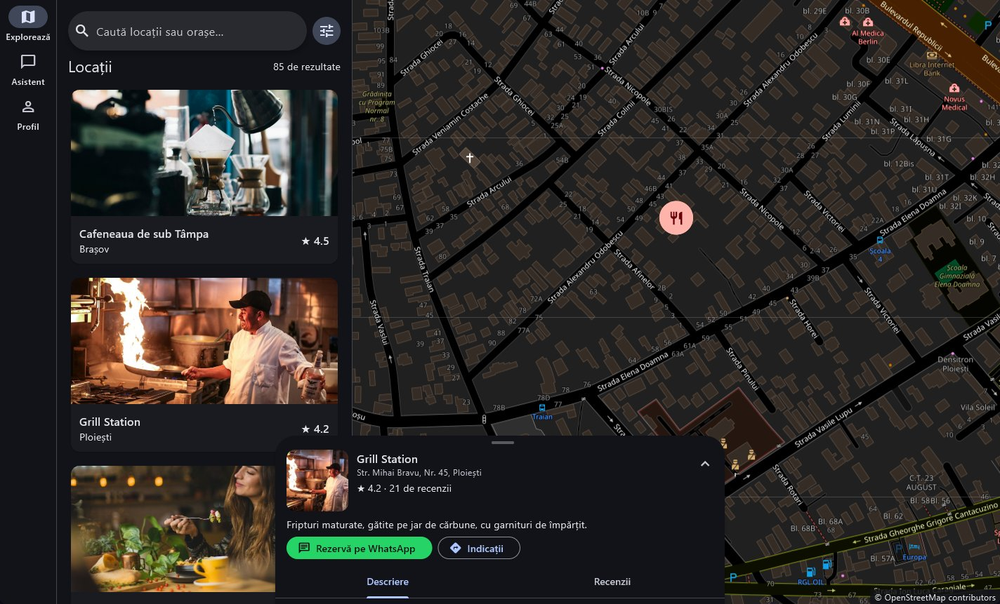
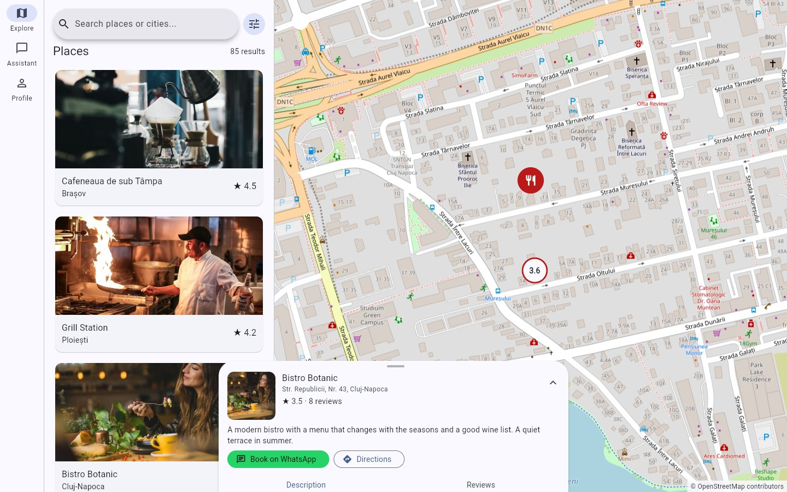
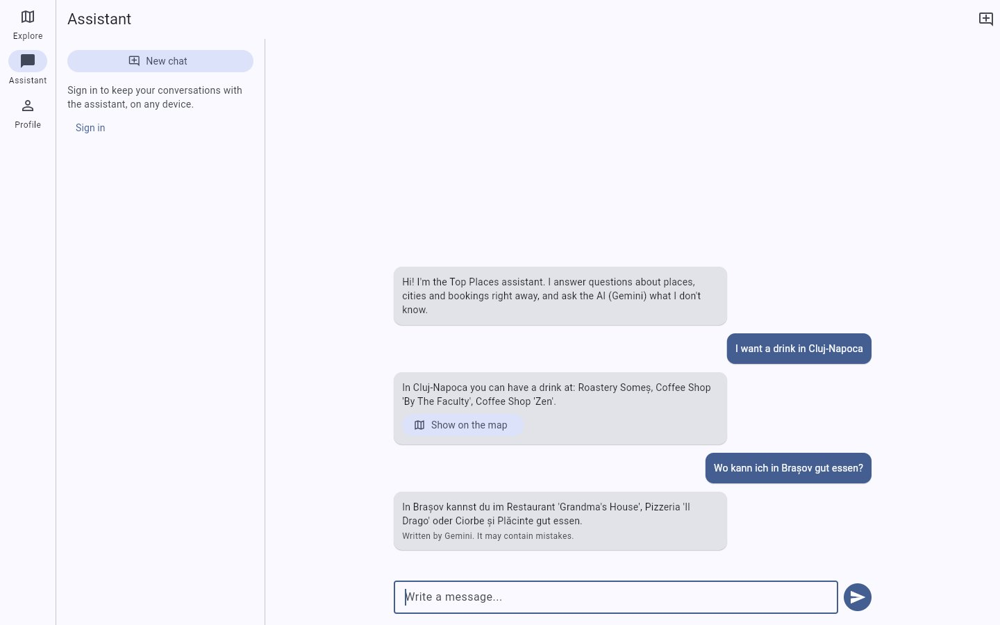

# Top Places

The best places to eat and drink in Romania, on a map, with reviews and an assistant. One Flutter codebase runs on **Android, the web and Windows**.

This is a rewrite of [Top Places](https://github.com/Tudorrr323/Aplicatie-Turism-Hackathon), a React Native (Expo) app built at the THECON hackathon in November 2025. The rewrite keeps what the app did, fixes what it got wrong (see [Compared to the original](#compared-to-the-original)) and adds accounts with roles, reviews, moderation and a chat history.

## Screenshots

The demo data of `supabase/seed_demo.sql`. On Android, signed in as the test admin.

**Android**, in English with the light theme

<table>
  <tr>
    <td align="center"><br><sub>Nearby places, grouped</sub></td>
    <td align="center"><br><sub>A place, from a search suggestion</sub></td>
    <td align="center"><br><sub>Its reviews, and your own</sub></td>
  </tr>
  <tr>
    <td align="center"><br><sub>The history of the chat</sub></td>
    <td align="center"><br><sub>Gemini answers in French</sub></td>
    <td align="center"><br><sub>Places waiting for an admin</sub></td>
  </tr>
</table>

**Windows**, in Romanian with the dark theme

<table>
  <tr>
    <td align="center"><br><sub>The list next to the map</sub></td>
    <td align="center"><br><sub>A place over the map</sub></td>
  </tr>
</table>

**The web**, in English with the light theme

<table>
  <tr>
    <td align="center"><br><sub>A place over the map</sub></td>
    <td align="center"><br><sub>The rules answer in English, Gemini in German</sub></td>
  </tr>
</table>

## What it does

**Explore**
- A map of the places (OpenStreetMap), with nearby markers grouped into a numbered bubble that splits as you zoom in. A list view, or both side by side on wide screens.
- A search bar with suggestions, plus filters by city and rating, and sorting.
- A GPS button that asks for permission and flies the map to where you are.
- Tapping a place opens a small card that drags up to a full screen, with a *Description* and a *Reviews* tab, directions and a WhatsApp booking link.

**Accounts** (Supabase Auth, with email confirmation)
- **Users** rate places from 1 to 5 stars, with an optional message. A review shows up once the place's operator, or an admin, accepts it, and the rating is the average of the accepted reviews.
- **Operators** add and edit their own places. A new place, or an edited one, waits for an admin. Operators also accept or reject the reviews of their places, with a reason.
- **Admins** approve, reject or suspend places and accounts, and decide who becomes an operator.

**Assistant**
- Rules answer common questions at once, in Romanian or English. When they find places, a *Show on map* button shows them.
- Anything else goes to Google Gemini. It recommends only the places in the app and answers in the language you write in, German or Italian included.
- Signed-in accounts keep a history of their conversations. Each one can be opened again, renamed or deleted.

**Everywhere**
- Romanian and English throughout. Places have a description in both languages, and the place form can translate one into the other.
- Light, dark or system theme.
- Without any configuration, the app still runs on the places bundled with it, with no accounts and no AI.

## Running it

You need Flutter 3.47 or newer.

```powershell
flutter pub get
flutter run -d windows        # or -d chrome, or an Android device
```

To connect Supabase and Gemini, copy `config/example.json` to `config/dev.json`, fill it in and pass it to Flutter. Git ignores `config/dev.json`.

```powershell
flutter run -d windows --dart-define-from-file=config/dev.json
```

| Value | Where it comes from |
|---|---|
| `SUPABASE_URL` | Project settings > API |
| `SUPABASE_PUBLISHABLE_KEY` | Project settings > API keys. Only the publishable key: the database rules protect the data, so it is safe in the app. Never the `service_role` key. |
| `GEMINI_API_KEY` | Google AI Studio |

In VS Code, the *Top Places (Gemini)* launch configuration passes the file for you.

## The database

All the rules live in the database, not only in the app. Row Level Security and triggers decide, for every request, who can see or change what. For example:
- An operator edits only their own places, and an edit sends the place back to review.
- Nobody reviews their own place.
- A suspended account's places and reviews disappear from public view.
- Conversations are private, even from admins.

The checks in the app are there only for comfort.

To set up a new Supabase project with everything, demo data included, run `supabase/setup.sql` once in the SQL Editor.

It is made from the files below by `supabase/tools/build_setup.js`. To set up the tables and rules only, run these from `supabase/` instead, in this order:

1. `schema.sql`
2. `002_public_places.sql`
3. `003_reviews_by_admins.sql`
4. `004_ratings.sql`
5. `005_reviews.sql`
6. `006_admin_reviews.sql`
7. `007_bilingual_places.sql`
8. `008_conversations.sql`

### Demo data (optional)

| File | Adds | Removed by |
|---|---|---|
| `conturi_test.sql` | One account per role and state, all with the password written in the file | deleting them under Authentication > Users |
| `seed_demo.sql` | 64 more places across Romania and about 2,200 reviews by 90 people who cannot sign in | `seed_demo_remove.sql` |
| `seed_conversations.sql` | Conversations with the assistant, in seven languages, for every account that can sign in | `seed_conversations_remove.sql` |

The two seeds are generated by the scripts in `supabase/tools/` and come out the same every time. The data is made up: remove it, and the test accounts, before real people use the project.

## Tests

```powershell
flutter analyze
flutter test                               # unit and widget tests, no emulator needed

cd supabase/tests
npm install
npm test                                   # the database rules, on a real Postgres
```

The database tests run every SQL file on [PGlite](https://pglite.dev), a real Postgres that runs in Node. They then act as a visitor, a user, an operator and an admin, the way Supabase does. They cover the migrations on databases that already hold data, and the seeds too. To check the tests themselves, the rules were broken on purpose, one at a time, to see that a test fails.

## How the code is organised

```
lib/
  models/       plain data: Place, Rating, Profile, Conversation, ChatMessage
  services/     Supabase, Gemini, location, and the assistant's rules (BotEngine).
                Behind interfaces, so the tests use fakes.
  view_models/  state shared through provider (ChangeNotifier): Explore, the account,
                the conversations, the language and the theme
  screens/      one per route, with go_router. The tabs keep their state.
  widgets/      the map, the place card, reviews, the conversation list…
  l10n/         the texts, in Romanian and English (ARB files, gen-l10n)
supabase/       the SQL files, the seeds and their generators, and the database tests
```

Main packages: `flutter_map`, `supabase_flutter`, `provider`, `go_router`, `geolocator`, `http`, `shared_preferences` and `url_launcher`.

## Compared to the original

| Area | The original | This version |
|---|---|---|
| Map tiles | An undocumented Google endpoint, against the Google Maps terms. No map on the web. | OpenStreetMap through `flutter_map`, on all three platforms. |
| Secrets | API keys and the database password committed to git. | Kept in `config/dev.json`, which git ignores. The app has only the publishable key, protected by Row Level Security. |
| Assistant | Romanian keywords matched inside English words ("vin", wine, inside "servings"). Cities with hyphens, like Cluj-Napoca, broke its actions, and *Show on map* did nothing from another tab. | Matches whole words and finds every city. *Show on map* opens the Explore tab. Gemini answers what the rules don't. |
| AI | Retired Gemini models, with canned text shown as "AI" after artificial delays. | A current model, with a timeout. Answers are marked as AI, and the app says when Gemini is unavailable. |
| Search | "București" found no places, because the data said "Bucharest". | The places know their city as "București", and their address still says "Bucharest", so both names find them, with or without diacritics. |
| Sessions | Signed you out every time the app started. | The session is kept. |
| Booking | A WhatsApp link that worked only on phones with WhatsApp installed. | A `wa.me` link, which works everywhere. |

## Known limits

- **Gemini key:** it is compiled into the app, so anyone with a build can extract it. That is acceptable for a demo on the free tier. A real launch would call Gemini from a server, for example a Supabase Edge Function.
- **Map tiles:** OpenStreetMap's public tiles are meant for light use. A real launch needs a tile provider.
- **Assistant languages:** the rules understand only Romanian and English. Other languages are recognised by a list of common words and sent to Gemini.
- **Platforms:** iOS, macOS and Linux are not set up.

## Credits

- Map data © [OpenStreetMap](https://www.openstreetmap.org/copyright) contributors.
- Photos from [Unsplash](https://unsplash.com).
- The logo is the one of the original app.
